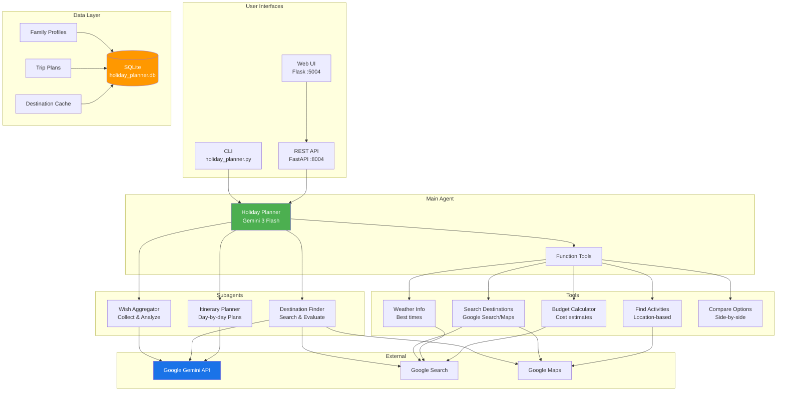
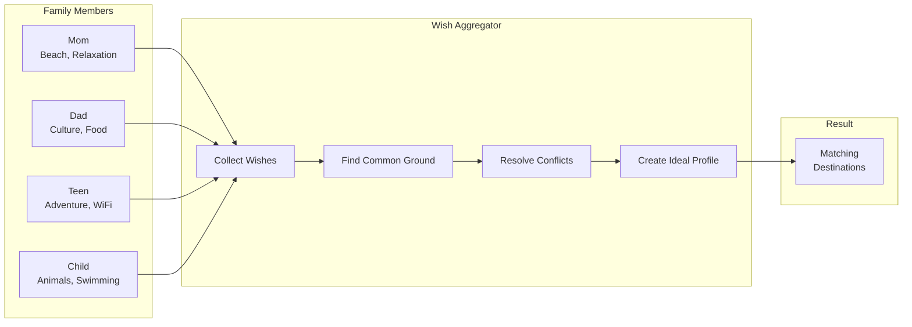
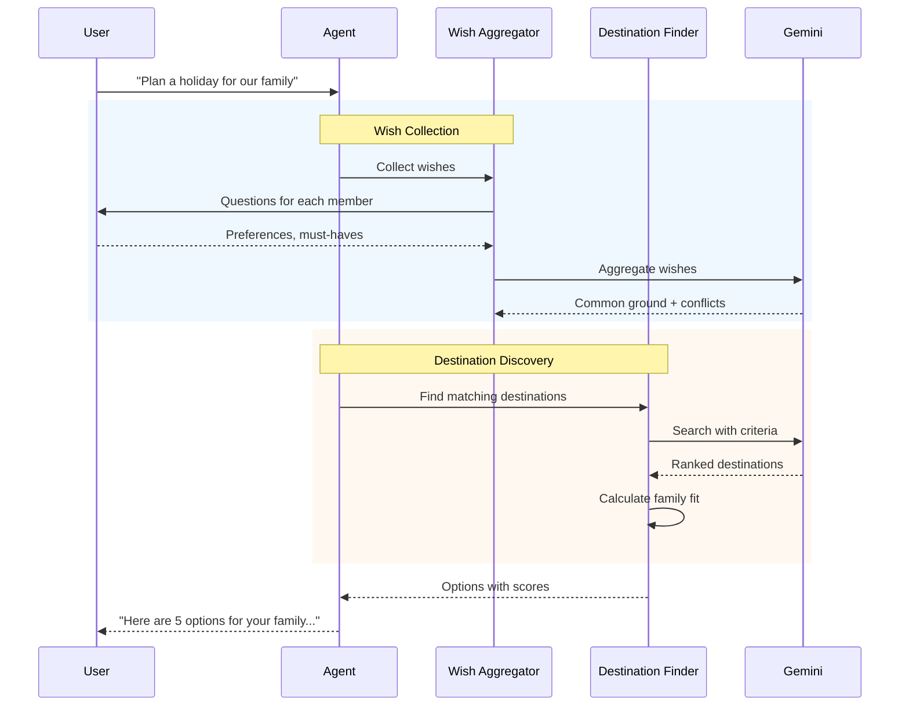

# Holiday Planner Agent

AI-powered agent for family holiday planning. Understands whole family wishes, recommends destinations that make everyone happy, and provides detailed comparisons and itineraries.

## Architecture Overview



## Features

### Core Capabilities

| Feature | Description |
|---------|-------------|
| **Family Profiling** | Store family members with ages, roles, and preferences |
| **Wish Collection** | Gather holiday wishes from each family member |
| **Wish Aggregation** | AI analyzes wishes to find common ground and conflicts |
| **Destination Search** | Find destinations matching family's combined wishes |
| **Activity Finding** | Find activities suitable for all ages |
| **Weather Analysis** | Check weather and best times to visit |
| **Budget Estimation** | Calculate trip costs including flights, hotels, activities |
| **Option Comparison** | Compare destinations side-by-side with family fit scores |
| **Itinerary Planning** | Create detailed day-by-day plans balanced for all |

### Family Wish Understanding



### Comparison & Decision Support

| Comparison Aspect | What's Compared |
|-------------------|-----------------|
| **Budget** | Total cost, per person, per day, breakdown |
| **Family Fit** | Score per member, matching wishes, concerns |
| **Activities** | Variety, age suitability, must-haves |
| **Weather** | Best months, temperature, rain risk |
| **Logistics** | Flight time, visa, language barrier |

## Quick Start

### Installation

```bash
cd session-3-ai-agents/agents/holiday-planner
pip install -r requirements.txt
```

### Environment Variables

| Variable | Required | Description |
|----------|----------|-------------|
| `GEMINI_API_KEY` | Yes | Google Gemini API key |
| `GOOGLE_AI_STUDIO_KEY` | Alt | Alternative Gemini key name |

### Running the Agent

#### CLI Mode

```bash
# Interactive chat
python holiday_planner.py --chat

# Single query
python holiday_planner.py "Find beach destinations for a family with teens"

# With family profile
python holiday_planner.py --family-id abc123 --chat

# Create family
python holiday_planner.py --family create "The Smiths"

# List families
python holiday_planner.py --family list
```

#### API + UI Mode

```bash
# Start API server (port 8004)
python api/main.py

# Start UI server (port 5004)
python ui/app.py
```

- API docs: http://localhost:8004/docs
- Web UI: http://localhost:5004

## Project Structure

```
holiday-planner/
├── holiday_planner.py              # Main orchestrator agent
├── agent_env.py                    # Environment loader
├── requirements.txt
│
├── api/
│   └── main.py                     # FastAPI REST API
│
├── ui/
│   ├── app.py                      # Flask web interface
│   └── templates/
│       ├── base.html               # Base template
│       ├── index.html              # Dashboard
│       ├── chat.html               # Chat interface
│       └── error.html              # Error page
│
├── subagents/
│   ├── wish_aggregator.py          # Collect and analyze wishes
│   ├── destination_finder.py       # Find matching destinations
│   └── itinerary_planner.py        # Create day-by-day plans
│
├── tools/
│   ├── search_destinations.py      # Destination search
│   ├── find_activities.py          # Activity finder
│   ├── weather_info.py             # Weather and timing
│   ├── budget_calculator.py        # Cost estimation
│   └── compare_options.py          # Side-by-side comparison
│
├── skills/
│   ├── family-profiling.md         # How to build profiles
│   ├── destination-search.md       # How to search
│   ├── comparison.md               # How to compare
│   └── itinerary-planning.md       # How to plan
│
└── memory/
    ├── memory.py                   # Memory CLI & functions
    ├── schemas/
    │   ├── family_schema.json      # Family profile schema
    │   └── trip_schema.json        # Trip plan schema
    └── data/
        ├── holiday_planner.db      # SQLite database
        ├── families/               # Family JSON files
        └── trips/                  # Trip JSON files
```

## Data Flow



## API Reference

### Family Management

| Endpoint | Method | Description |
|----------|--------|-------------|
| `/families` | GET | List all families |
| `/families` | POST | Create family |
| `/families/{id}` | GET | Get family profile |
| `/families/{id}/members` | POST | Add member |
| `/families/{id}/constraints` | PUT | Set constraints |
| `/families/{id}/wishes/aggregate` | POST | Aggregate wishes |

### Destinations

| Endpoint | Method | Description |
|----------|--------|-------------|
| `/destinations/search` | POST | Search destinations |
| `/destinations/{name}` | GET | Get destination details |
| `/destinations/{name}/activities` | GET | Find activities |
| `/destinations/{name}/weather` | GET | Get weather info |

### Trips

| Endpoint | Method | Description |
|----------|--------|-------------|
| `/trips` | GET | List trips |
| `/trips` | POST | Create trip |
| `/trips/{id}` | GET | Get trip details |
| `/trips/{id}/itinerary` | POST | Generate itinerary |

### Budget & Comparison

| Endpoint | Method | Description |
|----------|--------|-------------|
| `/budget/estimate` | POST | Estimate trip budget |
| `/budget/compare` | POST | Compare budgets |
| `/compare` | POST | Compare destinations |
| `/compare/weather` | POST | Compare weather |

### Chat

| Endpoint | Method | Description |
|----------|--------|-------------|
| `/chat` | POST | Chat with agent |
| `/chat/stream` | POST | Streaming chat |

## Usage Examples

### Create Family and Plan Trip

```
You: We're planning a summer holiday. Family of 4 - me and my wife (both 40s),
     a 14-year-old who loves adventure, and an 8-year-old who loves animals.

Agent: I'll help you plan the perfect family holiday! Let me create a profile
       for your family.
       
       Created family "Family" with:
       - 2 adults (40s)
       - 1 teen (14) - adventure lover
       - 1 child (8) - animal lover
       
       What's your budget and how many days are you thinking?

You: Around €5000 total, 10-12 days, flying from Helsinki

Agent: Perfect. Let me search for destinations that work for everyone...
       
       Here are 5 destinations that fit your family:
       
       1. **Crete, Greece** (92% family fit)
          - Adventure: Water sports, gorge hiking
          - Animals: Aquarium, donkey sanctuary
          - Beach and culture mix
          - Budget: €4,200 for 10 days
       
       2. **Costa Brava, Spain** (88% family fit)
          - Adventure: Kayaking, theme parks
          - Animals: Zoo, dolphin watching
          - Great food scene for parents
          - Budget: €4,500 for 10 days
       ...
```

### Compare Options

```
You: Compare Crete and Costa Brava for us

Agent: Here's a side-by-side comparison:

       | Aspect | Crete | Costa Brava |
       |--------|-------|-------------|
       | Total Budget | €4,200 | €4,500 |
       | Teen Score | 85% | 90% |
       | Child Score | 88% | 85% |
       | Adventure Level | ⭐⭐⭐⭐ | ⭐⭐⭐⭐⭐ |
       | Animal Activities | ⭐⭐⭐⭐ | ⭐⭐⭐ |
       | Flight Time | 4h | 3.5h |
       
       **Recommendation:** Crete offers better value and more animal
       experiences for your 8-year-old, while Costa Brava has slight
       edge for teen adventure activities. Crete wins overall for
       balanced family fit.
```

### Create Itinerary

```
You: Create a 10-day itinerary for Crete

Agent: Here's your family itinerary for Crete:

       **Day 1: Arrival in Heraklion**
       - 14:00: Check in to family hotel (pool!)
       - 16:00: Explore old town
       - 19:00: Welcome dinner at taverna
       
       **Day 2: Heraklion Discovery**
       - 10:00: CretAquarium (8-year-old highlight!)
       - 13:00: Lunch at harbor
       - 15:00: Pool time / Teen free time
       - 19:00: Dinner in town
       
       **Day 3: Adventure Day**
       - 09:00: Samaria Gorge hike (modified route for family)
       - Teen: Full gorge challenge option
       - Child: Shorter loop with guide
       ...
```

## Target Users

- **Families with children** of varying ages
- **Multi-generational trips** (grandparents, parents, kids)
- **Travel planners** booking family holidays
- **Anyone** wanting AI-assisted vacation planning

## Technical Notes

### Models Used

| Component | Model |
|-----------|-------|
| Main Agent | `gemini-3-flash-preview` |
| Wish Aggregation | `gemini-3-flash-preview` |
| Destination Search | `gemini-3-flash-preview` + Google Search |
| Itinerary Planning | `gemini-3-flash-preview` + Google Maps |

### Gemini Built-in Tools

The agent uses Gemini's integrated tools:
- **Google Search** - Real-time destination and activity info
- **Google Maps** - Location-aware recommendations
- **Function Calling** - Custom tool integration

### Key Design Decisions

1. **Family-centric**: Every feature considers all family members
2. **Conflict resolution**: AI helps balance different wishes
3. **Grounded search**: Real-time data via Google Search
4. **Bilingual**: Supports English and Finnish queries
5. **Comparison-first**: Easy side-by-side evaluation

## License

Internal use only.
