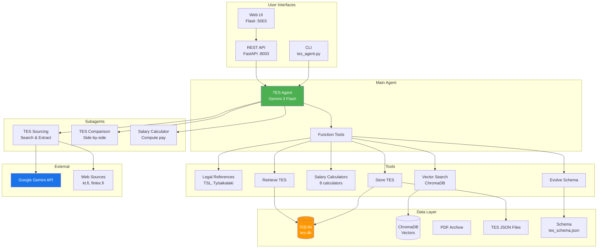
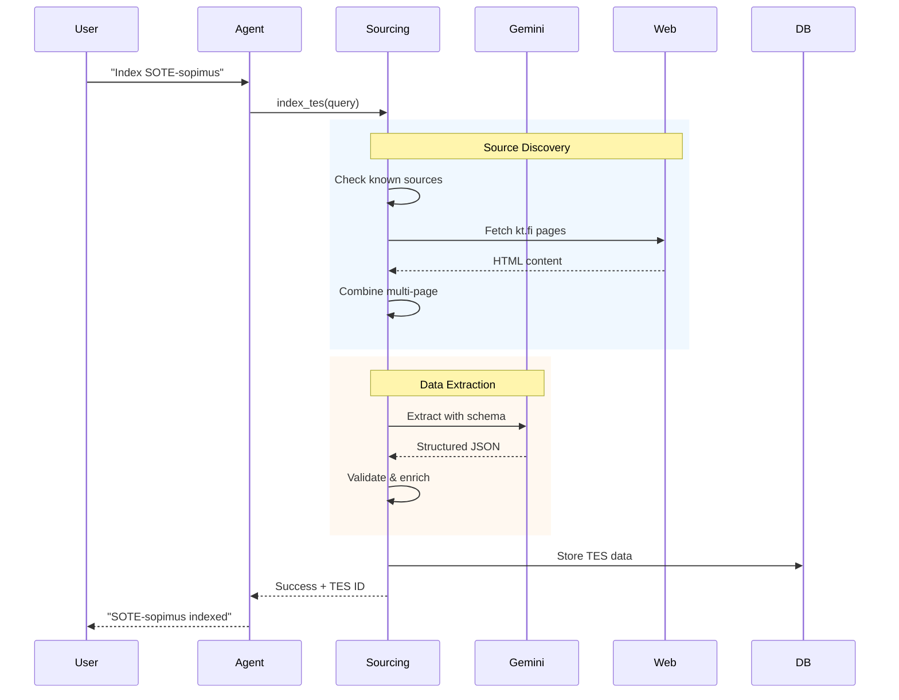
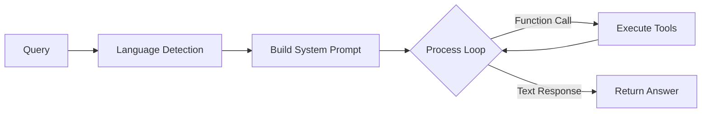
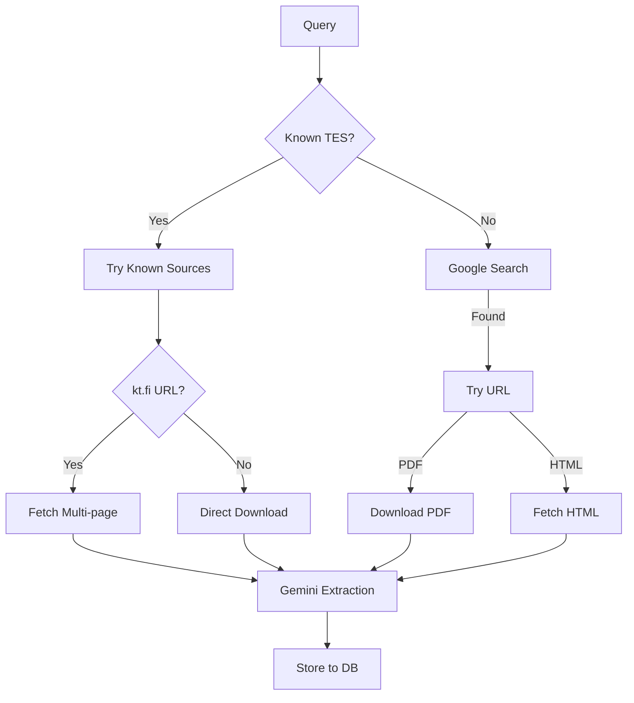
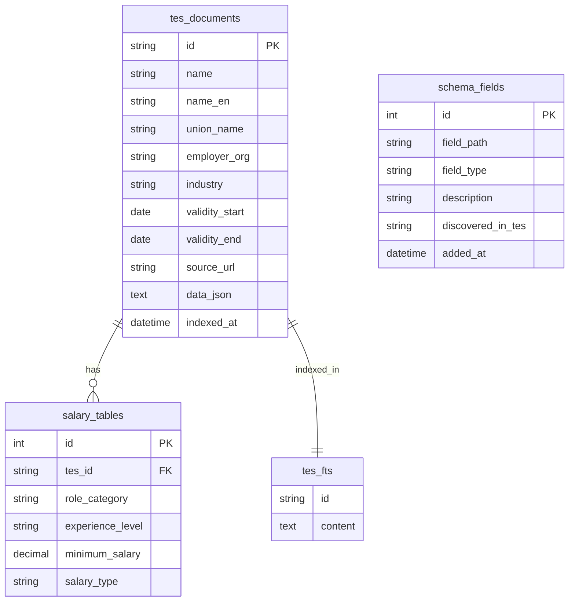
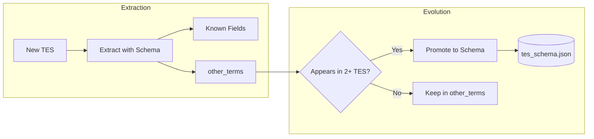

# TES Agent (Työehtosopimus-Agent)

AI-powered agent for Finnish collective bargaining agreements (Työehtosopimus/TES). Indexes TES documents on-demand, extracts structured data using an evolving schema, and provides a bilingual chatbot for querying, comparing, and calculating salary terms.

## Architecture Overview



## Features

### Core Features

| Feature | Description |
|---------|-------------|
| **TES Indexing** | Search, download, and extract TES documents from web sources (kt.fi, finlex.fi, union websites) |
| **Schema Evolution** | Automatically expands JSON schema as new TES fields are discovered |
| **Multi-page HTML Support** | Fetches and combines content from kt.fi's multi-page TES structure |
| **PDF Extraction** | Downloads and extracts structured data from PDF documents |
| **Bilingual Chat** | Responds in Finnish or English based on query language detection |
| **Citation Support** | Links back to specific PDF pages and HTML sections |

### Comparison & Analysis

| Feature | Description |
|---------|-------------|
| **TES Comparison** | Side-by-side comparison of multiple TES documents |
| **Legal References** | Cross-references to Työsopimuslaki (TSL), Työaikalaki, Vuosilomalaki |
| **Semantic Search** | Vector-based search across all indexed TES content using ChromaDB |
| **Full-text Search** | SQLite FTS5 for keyword searching |

### Salary Calculators

| Calculator | Description |
|------------|-------------|
| **Total Compensation** | Base salary + all allowances |
| **Shift Work** | Evening, night, weekend premiums |
| **Overtime** | Daily/weekly overtime rates |
| **Salary Comparison** | Compare across TES documents |
| **Experience Progression** | Salary growth over years |
| **Vacation Pay** | Holiday pay calculations |
| **Part-time Pro-rata** | Proportional salary for part-time |
| **Annual Employer Cost** | Total cost including side costs |

## Data Flow



## Quick Start

### Installation

```bash
cd session-3-ai-agents/agents/tes-agent
pip install -r requirements.txt
```

### Environment Variables

| Variable | Required | Description |
|----------|----------|-------------|
| `GEMINI_API_KEY` | Yes | Google Gemini API key |
| `GOOGLE_AI_STUDIO_KEY` | Alt | Alternative Gemini key name |

### Running the Agent

#### CLI Mode

```bash
# Interactive chat
python tes_agent.py --chat

# Single query
python tes_agent.py "What is the minimum salary in tech TES?"

# Index a new TES
python tes_agent.py --index "Teknologiateollisuuden TES"

# Compare TES documents
python tes_agent.py --compare tes_1,tes_2

# List indexed TES
python tes_agent.py --list
```

#### API + UI Mode

```bash
# Start API server (port 8003)
python api/main.py

# Start UI server (port 5003)
python ui/app.py
```

- API docs: http://localhost:8003/docs
- Web UI: http://localhost:5003

## Project Structure

```
tes-agent/
├── tes_agent.py                    # Main orchestrator agent
├── agent_env.py                    # Environment loader
├── requirements.txt
│
├── api/
│   └── main.py                     # FastAPI REST API
│
├── ui/
│   ├── app.py                      # Flask web interface
│   └── templates/
│       ├── base.html               # Base template
│       ├── index.html              # Dashboard
│       ├── chat.html               # Chat interface
│       ├── tes_list.html           # TES listing
│       ├── tes_detail.html         # TES details
│       ├── compare.html            # Comparison view
│       ├── calculators.html        # Salary calculators
│       ├── legal.html              # Legal references
│       └── search.html             # Semantic search
│
├── subagents/
│   ├── tes_sourcing.py             # Search, download, extract TES
│   ├── tes_comparison.py           # Compare multiple TES
│   └── salary_calculator.py        # Calculate salaries
│
├── tools/
│   ├── legal_references.py         # Finnish labor law cross-refs
│   ├── vector_search.py            # ChromaDB semantic search
│   ├── salary_calculators.py       # 8 salary calculator functions
│   ├── store_tes.py                # Store TES to database
│   ├── retrieve_tes.py             # Query TES data
│   ├── evolve_schema.py            # Schema evolution logic
│   ├── calculate_salary.py         # Basic salary calc
│   └── download_pdf.py             # PDF download utility
│
├── skills/
│   ├── tes-sourcing.md             # How to index TES
│   ├── tes-comparison.md           # How to compare
│   ├── salary-calculation.md       # How to calculate
│   └── tes-querying.md             # How to query
│
└── memory/
    ├── memory.py                   # Memory CLI & functions
    ├── tes_schema.json             # Evolving JSON schema
    ├── schemas/
    │   └── base_schema.json        # Initial schema template
    └── data/
        ├── tes.db                  # SQLite database
        ├── tes/                    # TES JSON files
        ├── pdfs/                   # Downloaded PDFs
        └── html/                   # Fetched HTML pages
```

## Component Details

### Main Agent (`tes_agent.py`)

The main orchestrator using Gemini 3 Flash with function calling:



**Key capabilities:**
- Up to 15 iterations for complex multi-step tasks
- Parallel function execution for batch operations
- Real-time logging via callback
- Chat history management

### TES Sourcing Subagent

Handles document discovery and extraction:



**Known TES sources:** SOTE, KVTES, Kauppa, MaRa, Rakennusala, Teknologia, Kiinteistö

### Legal References Tool

Cross-references TES terms to Finnish labor laws:

| Law | Code | Topics Covered |
|-----|------|----------------|
| Työsopimuslaki | TSL 55/2001 | Trial period, termination, sick leave |
| Työaikalaki | TAL 872/2019 | Working hours, overtime, breaks |
| Vuosilomalaki | VLL 162/2005 | Vacation days, holiday pay |
| Yhteistoimintalaki | YTL 1333/2021 | Co-determination, layoffs |

### Vector Search Tool

Semantic search using ChromaDB and Gemini embeddings:

- Model: `gemini-embedding-2`
- Chunking: By TES sections (salary, hours, vacation, etc.)
- Metadata: TES name, section, source URL

## API Reference

### Core Endpoints

| Endpoint | Method | Description |
|----------|--------|-------------|
| `/health` | GET | Health check |
| `/stats` | GET | Database statistics |
| `/chat` | POST | Chat with agent (streaming) |

### TES Management

| Endpoint | Method | Description |
|----------|--------|-------------|
| `/tes` | GET | List all indexed TES |
| `/tes/{id}` | GET | Get TES details |
| `/tes/{id}/salaries` | GET | Get salary tables |
| `/tes/index` | POST | Index new TES |
| `/compare` | POST | Compare TES documents |
| `/search?q=` | GET | Full-text search |

### Legal References

| Endpoint | Method | Description |
|----------|--------|-------------|
| `/legal/laws` | GET | List all labor laws |
| `/legal/topics` | GET | List all topics |
| `/legal/references/{topic}` | GET | Get references for topic |
| `/legal/tes/{id}` | GET | Get all refs for a TES |
| `/legal/compare/{id}` | GET | Compare to statutory minimum |

### Vector Search

| Endpoint | Method | Description |
|----------|--------|-------------|
| `/vector/search` | POST | Semantic search |
| `/vector/stats` | GET | Vector DB statistics |
| `/vector/reindex` | POST | Reindex all TES |

### Salary Calculators

| Endpoint | Method | Description |
|----------|--------|-------------|
| `/calc/total-compensation` | POST | Total compensation |
| `/calc/shift-work` | POST | Shift premiums |
| `/calc/overtime` | POST | Overtime pay |
| `/calc/compare` | POST | Compare salaries |
| `/calc/progression` | POST | Experience progression |
| `/calc/vacation-pay` | POST | Vacation pay |
| `/calc/part-time` | POST | Part-time pro-rata |
| `/calc/employer-cost` | POST | Annual employer cost |

## Database Schema



## Schema Evolution

The agent uses an evolving schema that expands as new TES documents introduce new fields:



**Current schema categories (50+):**
- Basic info (name, validity, parties)
- Salary (tables, increases, bonuses)
- Working hours (regular, overtime, breaks)
- Leave (vacation, sick, parental)
- Allowances (shift, travel, meals)
- Termination (notice, severance)
- And more...

## Usage Examples

### Index a TES

```
You: Index the SOTE-sopimus
Agent: Searching for SOTE-sopimus...
       Found known source: kt.fi
       Fetching 8 sections from kt.fi...
       Extracting data with Gemini...
       Successfully indexed: SOTE-sopimus 2025-2028
       Extracted: salary_tables, working_hours, overtime, 
                  shift_work, sick_leave, allowances
```

### Query with Legal References

```
You: What is the trial period in KVTES and how does it compare to law?

Agent: KVTES trial period: 6 months maximum

       Legal reference (TSL 1:4):
       - Law allows maximum 6 months
       - Can be extended for training absences
       - Must be agreed in writing
       
       KVTES matches statutory maximum.
```

### Calculate Salary

```
You: Calculate total compensation for a nurse with 10 years experience, 
     including evening and weekend shifts

Agent: Based on SOTE-sopimus:
       
       Base salary (experience level):     €3,200/month
       Evening allowance (15%):            €480
       Weekend allowance (20%):            €640
       Experience bonus:                   €150
       
       Total monthly compensation:         €4,470
```

### Semantic Search

```
You: Search for information about remote work policies

Agent: Found 3 relevant sections:

       1. KVTES - Etätyö (Working arrangements)
          "Etätyöstä sovitaan työnantajan ja työntekijän kesken..."
          Relevance: 0.92

       2. Teknologia TES - Flexible work
          "Remote work arrangements shall be agreed..."
          Relevance: 0.87
          
       3. ICT TES - Hybridityö
          "Hybridityömalli mahdollistaa..."
          Relevance: 0.81
```

## Target Users

- **Palkanlaskijat** (Payroll specialists)
- **HR-ammattilaiset** (HR professionals)
- **Työoikeuden asiantuntijat** (Employment law experts)
- **Luottamusmiehet** (Union representatives)
- **Työnantajajärjestöt** (Employer organizations)

## Technical Notes

### Models Used

| Component | Model |
|-----------|-------|
| Main Agent | `gemini-3-flash-preview` |
| Extraction | `gemini-3.1-flash-lite-preview` |
| Embeddings | `gemini-embedding-2` |

### Performance

- Parallel function execution for batch operations
- Up to 10 concurrent tool calls
- Multi-page fetching for kt.fi (combines 8+ sections)
- Streaming responses in chat

### Limitations

- Some TES documents are only available as HTML (SOTE, KVTES on kt.fi)
- PDF extraction quality depends on document structure
- Schema evolution requires manual promotion of fields

## License

Internal use only.
